# 基于大模型的模拟面试平台

<p align="center">
  <b>A Large Model Based Mock Interview Platform</b>
</p>

<p align="center">
  
  
  
  
  
  
</p>

---

## 项目简介

本项目是一个**基于大语言模型的智能模拟面试平台**，旨在为求职者提供沉浸式的 AI 模拟面试体验。平台集成了**科大讯飞星火认知大模型**和**字节跳动 Coze 平台**，结合**火山引擎 RTC 实时音视频通信**技术，实现了语音对话、实时字幕、多模态智能分析等核心功能。

用户可以选择不同的面试领域和岗位，与 AI 面试官进行实时语音对话，系统会自动记录面试过程并生成包含**能力雷达图**和**详细评估报告**的面试分析结果，帮助求职者发现自身不足，有针对性地提升面试能力。

---

## 核心功能

### 实时语音面试
- 基于**火山引擎 RTC SDK（v4.62+）** 的高质量实时音视频通信
- 支持 AI 语音对话，模拟真实面试场景
- 实时语音转文字，同步显示对话字幕
- 全屏摄像头模式，沉浸式面试体验
- 摄像头设备检测与切换，支持多路视频流

### AI 智能面试官
- 集成**扣子（Coze）平台 Realtime API**，打造专业 AI 面试官
- 支持多领域多岗位的面试问题生成
- 根据面试领域和岗位智能调整提问策略
- 虚拟面试官（Three.js 3D 渲染）与真实摄像头画面双画面布局
- 模拟真实面试对话流程，逻辑连贯的追问机制

### 多模态面试分析
- 接入**科大讯飞星火认知大模型（X1）** WebSocket API，对完整面试记录进行深度分析
- **文本分析**：话题相关性、语言结构、关键词密度、STAR 法则使用情况
- **音频分析**：语速、语调自信度、流畅度、音量稳定性
- **视频分析**：面部表情、眼神接触、坐姿仪态（基于 OpenCV）
- 自动生成**五维能力雷达图**（专业知识、岗位匹配度、语言表达、逻辑思维、抗压能力）
- 输出详细面试评估报告、关键问题清单、改进建议及学习资源推荐
- 星火 API 不可用时自动降级为静态分析数据，保证服务可用性

### 用户系统与数据管理
- 用户注册 / 登录 / 游客体验（集成 Firebase Authentication）
- 面试历史记录查看与管理，支持按类型、时间、关键词筛选
- 个人能力分析看板（综合评分、技能雷达图、个性化学习路径）
- 个人设置与偏好配置（面试时长、难度、主题、语言等）
- 响应式设计，同时支持桌面端（侧边栏布局）和移动端（底部导航）

---

## 系统架构

本系统采用**前后端分离 + 多服务集成**架构，整合 4 个外部服务与 2 个自研服务：

### 总体架构图

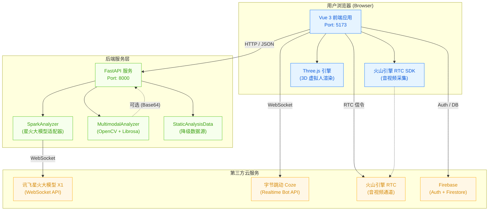

### 分层架构

```mermaid
graph LR
    subgraph 表现层["表现层 (Presentation)"]
        L["登录注册"]
        H["首页仪表盘"]
        I["实时面试"]
        R["分析报告"]
        REC["学习推荐"]
        AA["能力分析"]
        IR["面试记录"]
        S["系统设置"]
    end

    subgraph 业务层["业务层 (Service)"]
        AUTH["认证服务<br/>realtimeService.js"]
        CHAT["对话引擎<br/>Coze Realtime"]
        MEDIA["媒体服务<br/>VolcEngine RTC"]
        ANAL["分析服务<br/>apiService.js"]
    end

    subgraph 数据层["数据层 (Data)"]
        FBS["Firestore<br/>面试历史"]
        AUTH_DB["Firebase Auth<br/>用户凭证"]
        MOCK["mockData.js<br/>本地模拟"]
        STATIC["static_analysis_data.py<br/>降级数据"]
    end

    表现层 --> 业务层
    业务层 --> 数据层
```

---

## 核心流程时序图

### 完整面试流程时序图

下图展示从用户登录到获取分析报告的完整交互流程：

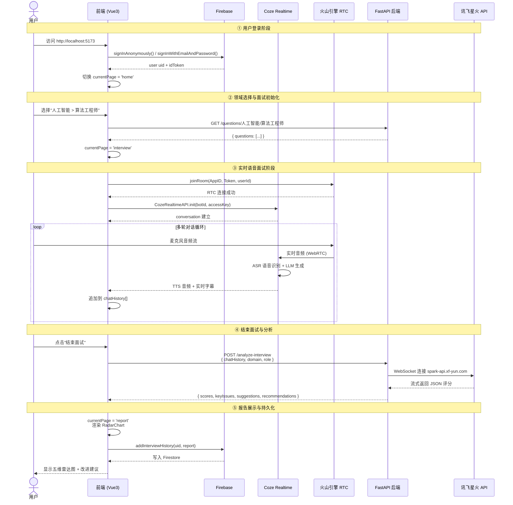

### 多模态分析管道

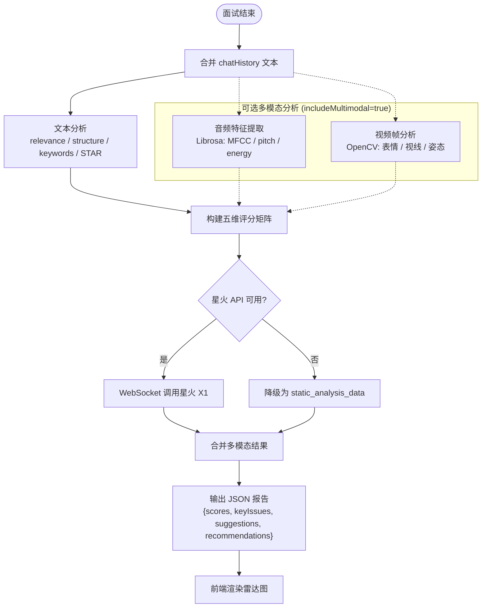

### 身份认证流程

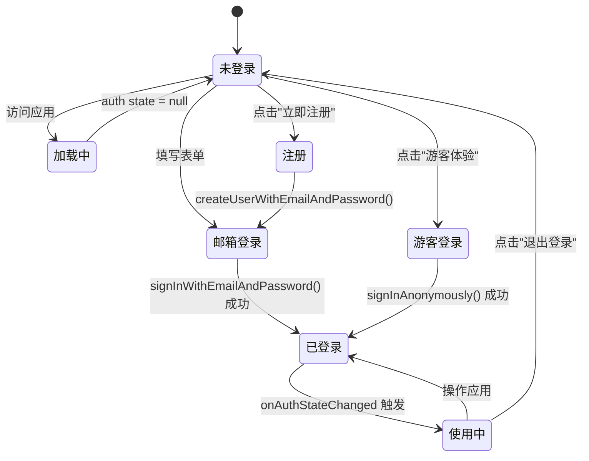

---

## 组件关系图

前端 21 个 Vue 组件的调用层级：

```mermaid
graph TD
    App["App.vue<br/>(根组件 + 侧边栏布局 + 路由状态)"]

    App --> Login["Login.vue<br/>(未登录时)"]
    App --> MobileNav["MobileNavigation.vue<br/>(移动端)"]

    App --> Home["Home.vue<br/>(桌面端首页)"]
    App --> MHome["MobileHome.vue<br/>(移动端首页)"]
    App --> RTI["RealtimeInterview.vue<br/>(核心 ~3000 行)"]
    App --> Report["Report.vue"]
    App --> Recs["Recommendations.vue"]
    App --> Records["InterviewRecords.vue"]
    App --> AA["AbilityAnalysis.vue"]
    App --> Settings["Settings.vue"]

    App --> TestA["TestAnalysis.vue"]
    App --> TestC["CameraTest.vue"]
    App --> TestF["FullscreenCameraTest.vue"]
    App --> TestCv["ConversationTest.vue"]

    Home --> DS["DomainSelector.vue"]
    MHome --> DS

    RTI --> VI["VirtualInterviewer.vue<br/>(Three.js 3D)"]
    RTI --> FC["FullscreenCamera.vue"]
    RTI --> SC["SimpleCamera.vue"]

    Report --> RC["RadarChart.vue<br/>(Canvas 五维图)"]
    Report --> Pag["Pagination.vue"]
    Records --> Pag
    AA --> RC
    Recs --> Pag

    classDef root fill:#1677ff,color:#fff,stroke:#0958d9
    classDef main fill:#e6f4ff,stroke:#1677ff,color:#0958d9
    classDef child fill:#f0f8ff,stroke:#4096ff,color:#1677ff
    classDef test fill:#fff7e6,stroke:#faad14
    class App root
    class Home,RTI,Report,Records,AA,Settings,Recs,MHome main
    class DS,VI,FC,SC,RC,Pag,Login,MobileNav child
    class TestA,TestC,TestF,TestCv test
```

---

## 系统界面截图

以下截图展示了系统在桌面端（1440×900）和移动端（375×812）的主要页面布局：

### 登录页

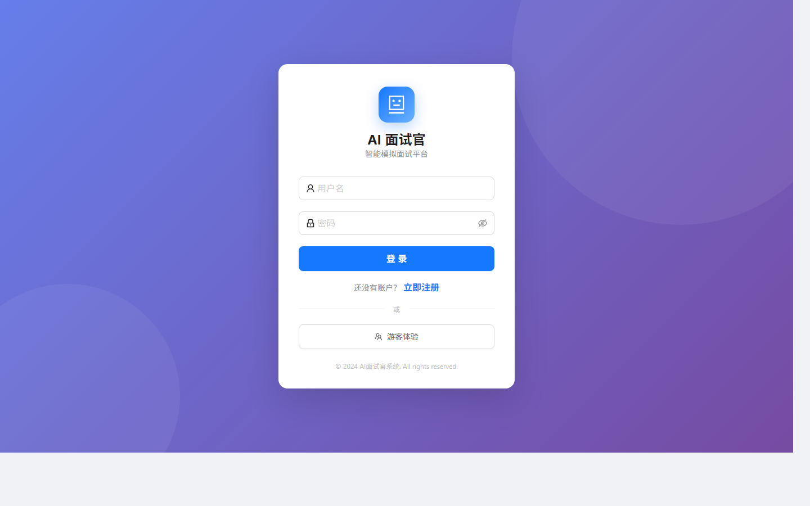

- 左侧蓝紫色渐变背景，品牌标识突出
- 登录卡片居中，支持**邮箱登录 / 注册 / 游客体验**三种入口
- 使用 Firebase Authentication，密码字段默认隐藏，可切换显示

### 首页仪表盘

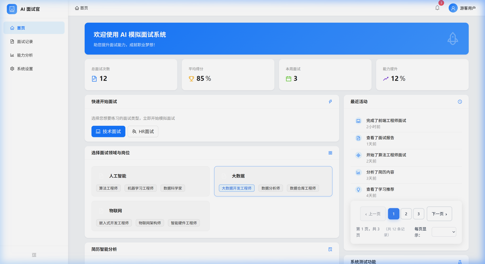

- 顶部 **4 张统计卡片**：总面试次数、平均得分、本周面试、能力提升百分比
- **快速开始** 区域：一键选择"技术面试 / HR 面试"
- **领域/岗位选择**：人工智能 / 大数据 / 物联网 三大领域，每个领域下三种岗位
- **简历智能分析**：支持 PDF / DOC / DOCX 上传
- **最近活动** 时间线：显示最近 5 条用户操作记录
- **系统测试功能**：提供分析 / 摄像头 / 对话三个调试入口

### 面试记录页

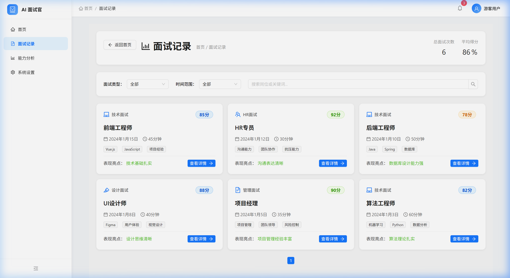

- 顶部显示**累计统计**（总面试次数 6、平均得分 86 分）
- 筛选栏：**面试类型** + **时间范围** + **关键词搜索**
- 卡片式记录列表：显示类型标签、得分、岗位、日期、时长、技能标签、表现亮点
- 每条记录可点击"查看详情"展开

### 能力分析看板

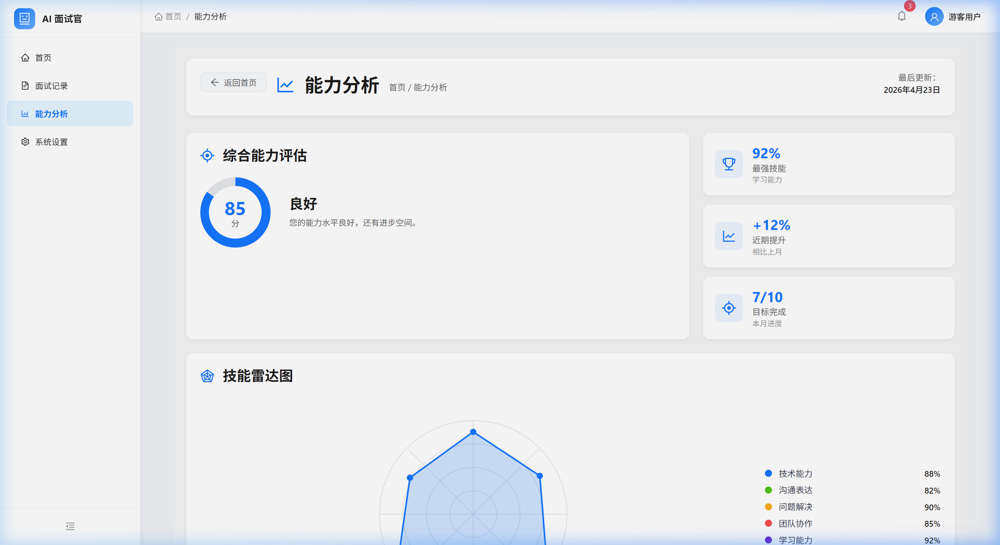

- 左侧**综合能力评估**：圆形进度 + 等级标签（优秀/良好/合格）
- 右侧 3 张小卡片：最强技能、近期提升、目标完成进度
- 下方雷达图 + 历史趋势折线图 + 推荐学习路径

### 系统设置页

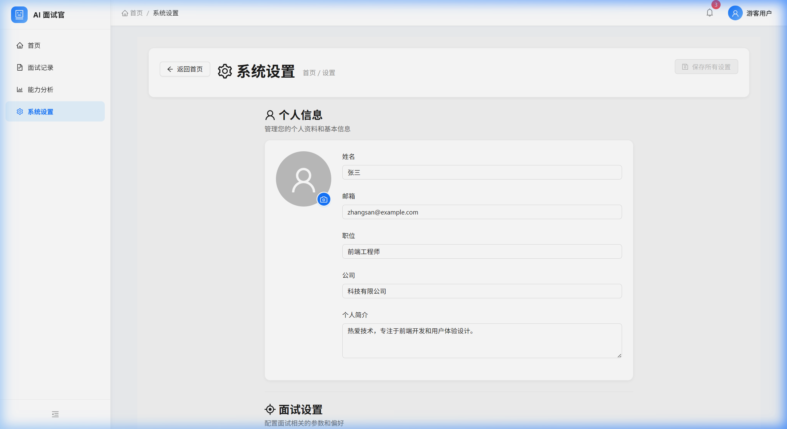

- **个人信息**：头像、姓名、邮箱、职位、公司
- **面试偏好**：默认时长、难度、语言、领域
- **隐私与安全**：密码修改、登出其他设备、删除账号

### 实时面试界面

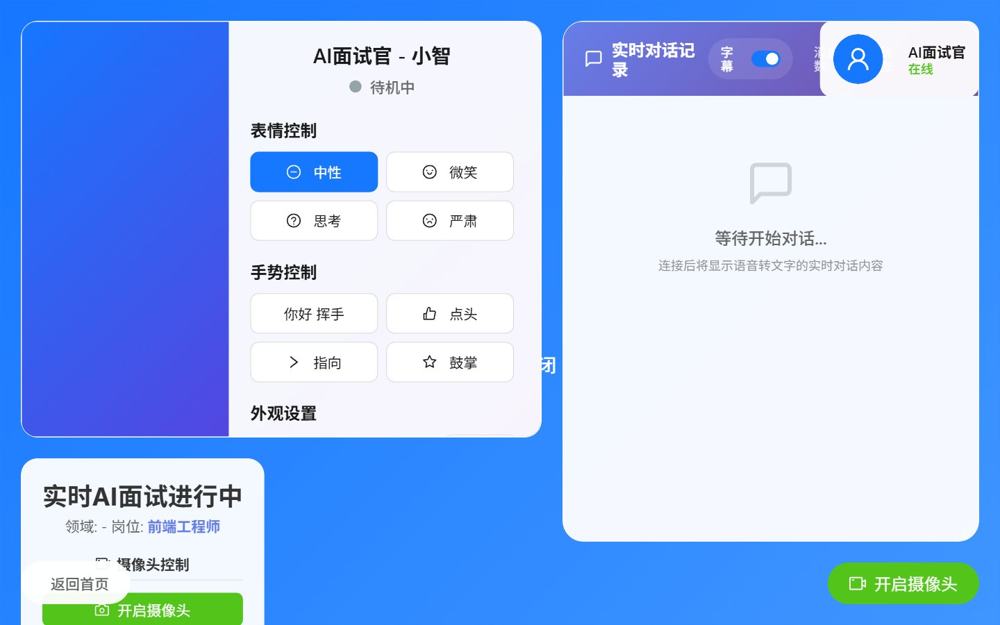

- **全屏沉浸式布局**：侧边栏/顶栏自动隐藏（`v-if="currentPage !== 'interview'"`）
- 左侧摄像头占位背景（蓝色渐变，可启用真实摄像头画面）
- 中央**虚拟面试官控制面板**：表情控制（中性/微笑/思考/严肃）+ 手势控制（挥手/点头/指向/鼓掌）
- 右上 **AI 面试官头像卡** 显示在线状态
- 右侧**实时对话记录** 面板：字幕开关 + 消息数 + 连接状态
- 底部左下**面试信息** + "返回首页"按钮
- 右下**摄像头开启/关闭**大按钮

### 面试评测报告

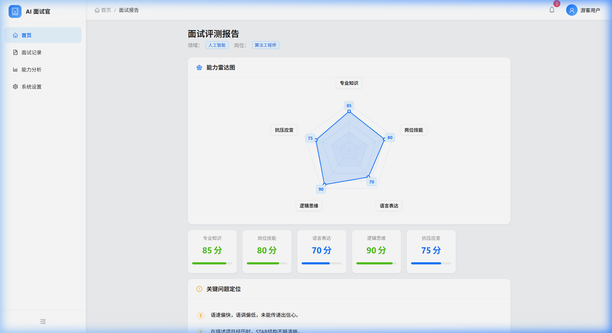

- 顶部**领域与岗位**标签
- **能力雷达图**（Canvas 绘制）：五维分数（85/80/70/90/75）
- 五张**分数卡**：专业知识、岗位技能、语言表达、逻辑思维、抗压应变
- **关键问题定位**列表：AI 识别出的 3 条待改进要点
- **改进建议**列表：4 条具体可执行的建议
- 底部按钮：查看学习推荐 / 返回首页

### 学习资源推荐

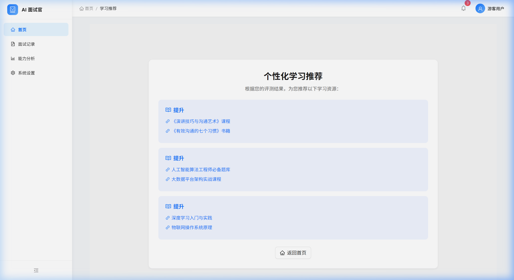

- 根据报告五维弱项自动匹配相关学习资源
- 每项提升方向下推荐 2 个资源（课程 / 书籍 / 题库）
- 支持分页浏览

### 移动端适配

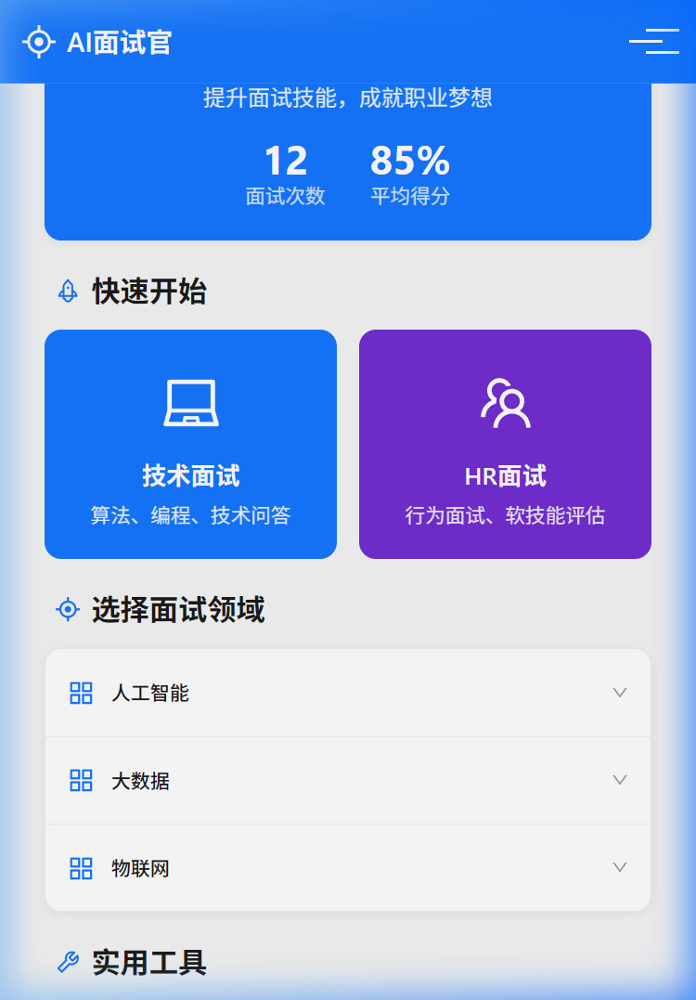

- 针对 375×812 移动端视口优化
- 顶部汉堡菜单 + 品牌标识
- 蓝色大卡片突出主要统计（12 次面试 / 85% 平均分）
- **快速开始**：技术面试（蓝）/ HR 面试（紫）大按钮
- 底部固定导航栏（`MobileNavigation.vue`）

---

## 数据结构文档

### 1. 后端 Pydantic 请求模型

位于 `my - 副本/q/main.py`：

| 模型名称 | 字段 | 类型 | 说明 |
|---------|------|------|------|
| `InterviewAnalysisRequest` | `chatHistory` | `List[str]` | 完整对话记录 |
| | `domain` | `str` | 面试领域（如"人工智能"）|
| | `role` | `str` | 目标岗位（如"算法工程师"）|
| | `useStaticData` | `bool` | 是否使用静态降级数据 |
| | `includeMultimodal` | `bool` | 是否启用多模态分析 |
| `InterviewQuestionRequest` | `domain` | `str` | 面试领域 |
| | `role` | `str` | 目标岗位 |
| `MultimodalAnalysisRequest` | `videoData` | `Optional[str]` | Base64 编码的视频帧 |
| | `audioData` | `Optional[str]` | Base64 编码的音频片段 |
| | `textContent` | `str` | 答题文本内容 |
| | `domain` | `str` | 面试领域 |
| | `role` | `str` | 目标岗位 |

### 2. 后端分析响应结构

`POST /analyze-interview` 返回体：

| 字段 | 类型 | 示例值 | 说明 |
|------|------|--------|------|
| `scores.professional_knowledge` | `int 0-100` | `85` | 专业知识评分 |
| `scores.job_skill_match` | `int 0-100` | `78` | 岗位技能匹配度 |
| `scores.language_expression` | `int 0-100` | `82` | 语言表达能力 |
| `scores.logical_thinking` | `int 0-100` | `88` | 逻辑思维能力 |
| `scores.stress_resistance` | `int 0-100` | `75` | 抗压应变能力 |
| `key_issues` | `List[str]` | `["项目描述缺乏量化数据"]` | 关键问题列表 |
| `improvement_suggestions` | `List[str]` | `["建议使用 STAR 法则"]` | 改进建议列表 |
| `learning_recommendations` | `Dict[str, List]` | 见下表 | 按能力维度分组的学习资源 |
| `multimodalAnalysis.audioScore` | `int` | `80` | 可选：音频分析总分 |
| `multimodalAnalysis.videoScore` | `int` | `75` | 可选：视频分析总分 |
| `multimodalAnalysis.textScore` | `int` | `85` | 可选：文本分析总分 |

### 3. 前端核心数据模型

位于 `src/utils/mockData.js` 与 `src/App.vue`：

#### 3.1 `mockInterviewDomains` — 面试领域配置

| id | name | roles |
|----|------|-------|
| `ai` | 人工智能 | 算法工程师、机器学习工程师、数据科学家 |
| `bigdata` | 大数据 | 大数据开发工程师、数据分析师、数据仓库工程师 |
| `iot` | 物联网 | 嵌入式开发工程师、物联网架构师、智能硬件工程师 |

#### 3.2 `feedbackData` — 报告数据对象

```typescript
interface FeedbackData {
  professionalKnowledge: number;   // 0-100
  jobSkillMatch: number;           // 0-100
  languageExpression: number;      // 0-100
  logicalThinking: number;         // 0-100
  stressResistance: number;        // 0-100
  keyIssues: string[];             // 关键问题数组
  improvementSuggestions: string[];// 改进建议数组
}
```

#### 3.3 `radarChartLabels` — 雷达图维度标签

| 索引 | 英文字段 | 中文标签 |
|------|----------|----------|
| 0 | `professionalKnowledge` | 专业知识 |
| 1 | `jobSkillMatch` | 岗位技能 |
| 2 | `languageExpression` | 语言表达 |
| 3 | `logicalThinking` | 逻辑思维 |
| 4 | `stressResistance` | 抗压应变 |

#### 3.4 `mockLearningRecommendations` — 学习资源结构

```typescript
interface LearningRecommendations {
  [category: string]: Array<{
    title: string;    // 资源标题
    link: string;     // 资源链接
  }>;
}
```

### 4. Firebase Firestore 数据库设计

采用**多租户层级路径**隔离用户数据：

```
artifacts/{appId}/users/{userId}/interviewHistory/{recordId}
```

#### 4.1 `interviewHistory` 集合字段

| 字段 | 类型 | 示例 | 说明 |
|------|------|------|------|
| `recordId` | `string (auto-id)` | `abc123xyz` | Firestore 自动生成的文档 ID |
| `userId` | `string` | `uid_of_user` | 用户 UID（冗余存储）|
| `timestamp` | `Timestamp` | `2024-01-15T10:30:00Z` | 面试完成时间 |
| `domain` | `string` | `"人工智能"` | 面试领域 |
| `role` | `string` | `"算法工程师"` | 目标岗位 |
| `type` | `string` | `"技术面试"` | 面试类型 |
| `duration` | `number` | `45` | 面试时长（分钟）|
| `score` | `number` | `85` | 综合得分 |
| `scores` | `object` | `{...}` | 五维详细评分 |
| `chatHistory` | `array<string>` | `[...]` | 完整对话记录 |
| `keyIssues` | `array<string>` | `[...]` | 关键问题列表 |
| `improvementSuggestions` | `array<string>` | `[...]` | 改进建议列表 |
| `tags` | `array<string>` | `["Vue.js","JavaScript"]` | 技能标签 |
| `highlights` | `string` | `"技术基础扎实"` | 表现亮点摘要 |

#### 4.2 Firebase Auth 用户字段

| 字段 | 来源 | 说明 |
|------|------|------|
| `uid` | Firebase 自动生成 | 用户唯一标识 |
| `email` | 注册填写 | 邮箱地址（匿名用户为 null）|
| `displayName` | 用户设置 | 显示名称 |
| `isAnonymous` | Firebase | 是否为游客账号 |
| `metadata.creationTime` | Firebase | 账号创建时间 |
| `metadata.lastSignInTime` | Firebase | 最近登录时间 |

### 5. 后端静态数据模板

`static_analysis_data.py` 内置三档评分模板：

| 模板等级 | 专业知识 | 岗位技能 | 语言表达 | 逻辑思维 | 抗压能力 |
|----------|----------|----------|----------|----------|----------|
| `excellent` | 90 | 88 | 85 | 92 | 87 |
| `good` | 75 | 78 | 72 | 80 | 73 |
| `average` | 60 | 62 | 58 | 65 | 60 |
| `below_average` | 45 | 48 | 42 | 50 | 45 |

每个领域×岗位组合都包含 `questions[]`（5 题）+ `keywords[]`（6-10 个行业关键词）。

---

## 项目结构

```
基于大模型的模拟面试平台的设计与实现/
│
├── my - 副本/
│   │
│   ├── realtime-quickstart-vue/          # 前端应用 (Vue.js)
│   │   ├── src/
│   │   │   ├── components/               # 全部 UI 组件（21个）
│   │   │   │   ├── App.vue               # 根组件，含侧边栏布局与路由控制
│   │   │   │   ├── Login.vue             # 登录/注册页（Firebase Auth）
│   │   │   │   ├── Home.vue              # 首页仪表盘（统计/领域选择/简历上传）
│   │   │   │   ├── RealtimeInterview.vue # 核心实时面试组件（~3000行）
│   │   │   │   ├── VirtualInterviewer.vue # Three.js 3D虚拟面试官
│   │   │   │   ├── DomainSelector.vue    # 面试领域与岗位选择
│   │   │   │   ├── Report.vue            # 面试分析报告展示
│   │   │   │   ├── RadarChart.vue        # 五维能力雷达图（Canvas）
│   │   │   │   ├── AbilityAnalysis.vue   # 能力分析看板
│   │   │   │   ├── InterviewRecords.vue  # 面试记录列表与筛选
│   │   │   │   ├── Recommendations.vue   # 学习资源推荐
│   │   │   │   ├── Settings.vue          # 用户设置页
│   │   │   │   ├── CameraTest.vue        # 摄像头功能测试
│   │   │   │   ├── FullscreenCamera.vue  # 全屏摄像头组件
│   │   │   │   ├── FullscreenCameraTest.vue  # 全屏摄像头测试
│   │   │   │   ├── SimpleCamera.vue      # 精简摄像头组件
│   │   │   │   ├── ConversationTest.vue  # 对话功能测试
│   │   │   │   ├── TestAnalysis.vue      # 分析功能测试
│   │   │   │   ├── MobileHome.vue        # 移动端首页
│   │   │   │   ├── MobileNavigation.vue  # 移动端导航栏
│   │   │   │   └── Pagination.vue        # 通用分页组件
│   │   │   ├── hooks/                    # Vue 组合式函数
│   │   │   ├── utils/
│   │   │   │   ├── realtimeService.js    # Firebase 服务封装
│   │   │   │   └── mockData.js           # 模拟数据与常量
│   │   │   ├── App.vue                   # 应用入口（含布局与路由）
│   │   │   ├── main.ts                   # Vue 应用挂载
│   │   │   └── network-error-manager.ts  # 网络错误统一管理
│   │   ├── public/                       # 静态资源
│   │   ├── config/                       # 构建配置
│   │   ├── package.json
│   │   ├── tsconfig.json
│   │   └── vue.config.js
│   │
│   └── q/                                # 后端 API 服务 (Python)
│       ├── main.py                       # FastAPI 主入口，路由定义
│       ├── spark_analyzer.py             # 星火大模型 WebSocket 分析器
│       ├── multimodal_analyzer.py        # 多模态分析（视频/音频/文本）
│       ├── static_analysis_data.py       # 静态分析数据（降级备份）
│       ├── start_system.py               # 一键启动脚本
│       ├── test_api.py                   # API 接口测试
│       ├── requirements.txt              # Python 依赖清单
│       └── .env                          # API 密钥配置（不提交）
│
├── deployment_guide.md                   # 部署指南
└── readme.md                             # 项目说明（本文件）
```

---

## 技术栈

### 前端

| 技术 | 版本 | 用途 |
|------|------|------|
| Vue.js | 3.x | 前端框架（Composition API）|
| TypeScript | 5.x | 类型安全 |
| Ant Design Vue | 4.2.6 | UI 组件库（主色 #1677ff）|
| @ant-design/icons-vue | 7.0.1 | 图标库 |
| Three.js | 0.178.0 | 3D 虚拟面试官渲染 |
| Firebase | 10.0.0 | 用户认证与面试历史云存储 |
| @coze/realtime-api | latest | Coze AI 实时语音对话 |
| @coze/api | latest | Coze HTTP API 调用 |
| @volcengine/rtc | 4.62.11 | 火山引擎实时音视频通信 |

### 后端

| 技术 | 版本 | 用途 |
|------|------|------|
| Python | 3.8+ | 后端开发语言 |
| FastAPI | 0.104.1 | Web API 框架 |
| Uvicorn | 0.24.0 | ASGI 服务器 |
| Pydantic | 2.5.0 | 请求/响应数据验证 |
| websocket-client | 1.6.4 | 星火 API WebSocket 通信 |
| OpenCV | 4.8.1 | 视频帧分析（面部表情/姿态）|
| Librosa | 0.10.1 | 音频特征提取与分析 |
| NumPy | 1.24.3 | 数值计算 |
| SciPy | 1.11.4 | 科学计算 |
| scikit-learn | 1.3.2 | 机器学习辅助分析 |
| Pandas | 2.1.4 | 数据处理 |
| Pillow | 10.1.0 | 图像处理 |

---

## API 接口文档

后端基于 FastAPI 构建，启动后可访问 `http://localhost:8000/docs` 查看交互式 Swagger 文档。

### 接口列表

| 方法 | 路径 | 说明 |
|------|------|------|
| `GET` | `/` | 服务信息（版本、功能列表）|
| `GET` | `/health` | 健康检查，返回服务状态 |
| `GET` | `/domains` | 获取所有可用面试领域 |
| `GET` | `/roles/{domain}` | 获取指定领域下的岗位列表 |
| `GET` | `/questions/{domain}/{role}` | 获取指定领域/岗位的面试题 |
| `POST` | `/analyze-interview` | 面试记录分析（星火 API 或静态降级）|
| `POST` | `/analyze-multimodal` | 多模态综合分析（文本+音频+视频）|
| `GET` | `/test-static-analysis` | 测试静态分析功能是否正常 |

### 分析请求体示例

```json
POST /analyze-interview
{
  "chatHistory": [
    {"role": "user", "content": "我有3年Vue开发经验..."},
    {"role": "assistant", "content": "请描述一个复杂项目..."}
  ],
  "domain": "frontend",
  "role": "前端工程师",
  "useStaticData": false,
  "includeMultimodal": false
}
```

### 分析响应体结构

```json
{
  "scores": {
    "professional_knowledge": 85,
    "job_skill_match": 78,
    "language_expression": 82,
    "logical_thinking": 88,
    "stress_resistance": 75
  },
  "key_issues": [
    "项目经验描述不够具体，缺少量化数据",
    "技术细节阐述深度不足"
  ],
  "improvement_suggestions": [
    "使用 STAR 法则描述项目经验",
    "补充性能优化的具体数据指标"
  ],
  "learning_recommendations": {
    "professional_knowledge": [
      {"title": "Vue3 源码解析", "link": "https://..."}
    ],
    "language_expression": [
      {"title": "技术面试表达技巧", "link": "https://..."}
    ]
  },
  "multimodalAnalysis": {
    "audioScore": 80,
    "videoScore": 75,
    "textScore": 85
  }
}
```

---

## 快速开始

### 环境要求

- **Node.js** >= 16.x（推荐 18.x LTS）
- **Python** >= 3.8（推荐 3.9 – 3.11）
- **npm** 或 **yarn** 包管理器

### 1. 克隆项目

```bash
git clone https://github.com/AIME-JF/A-Large-Model-Based-Mock-Interview.git
cd A-Large-Model-Based-Mock-Interview
```

### 2. 配置 API 密钥

在 `my - 副本/q/` 目录下创建 `.env` 文件：

```env
# 科大讯飞星火大模型
SPARK_APPID=your_appid
SPARK_API_SECRET=your_api_secret
SPARK_API_KEY=your_api_key
```

前端 Firebase 配置位于 `my - 副本/realtime-quickstart-vue/src/App.vue`（`firebaseConfig` 对象）。

Coze API 密钥配置位于 `RealtimeInterview.vue` 中（`COZE_API_KEY`、`BOT_ID`）。

火山引擎 RTC 配置位于 `RealtimeInterview.vue` 中（`RTC_APP_ID`、`RTC_TOKEN`）。

### 3. 安装依赖

```bash
# 后端依赖
cd "my - 副本/q"
pip install -r requirements.txt

# 前端依赖
cd "../realtime-quickstart-vue"
npm install
```

### 4. 启动服务

```bash
# 终端 1：启动后端 API 服务
cd "my - 副本/q"
python main.py
# 服务地址: http://localhost:8000
# API 文档: http://localhost:8000/docs

# 终端 2：启动前端应用
cd "my - 副本/realtime-quickstart-vue"
npm start
# 服务地址: http://localhost:5173
```

### 5. 验证服务

| 服务 | 地址 | 说明 |
|------|------|------|
| 后端 API | http://localhost:8000 | 返回服务信息 JSON |
| API 文档 | http://localhost:8000/docs | Swagger 交互式文档 |
| 前端应用 | **http://localhost:5173** | 主入口，开始模拟面试 |

---

## 使用流程

1. **登录系统** — 访问 `http://localhost:5173`，注册账号、登录或选择游客体验
2. **选择面试类型** — 在首页选择面试领域（人工智能、大数据、物联网等）和目标岗位
3. **开始面试** — 系统自动建立 RTC 连接，与 AI 面试官进行实时语音对话
4. **查看分析** — 面试结束后，后端调用星火大模型生成能力雷达图和评估报告
5. **回顾记录** — 在「面试记录」页面查看历史面试，在「能力分析」页面跟踪成长曲线

---

## 前端页面说明

| 页面 | 路由方式 | 说明 |
|------|----------|------|
| 登录页 | `isLoggedIn = false` | 注册、登录、游客体验 |
| 首页仪表盘 | `currentPage = 'home'` | 统计卡片、快速开始、领域选择、简历分析 |
| 实时面试 | `currentPage = 'interview'` | 核心面试界面，含 RTC 音视频、AI 对话、字幕 |
| 面试报告 | `currentPage = 'report'` | 五维雷达图、评分详情、改进建议 |
| 学习推荐 | `currentPage = 'recommendations'` | 针对薄弱项的学习资源推荐 |
| 面试记录 | `currentPage = 'interview-records'` | 历史记录列表，支持筛选与搜索 |
| 能力分析 | `currentPage = 'ability-analysis'` | 综合能力看板、技能趋势、学习路径 |
| 系统设置 | `currentPage = 'settings'` | 个人信息、面试偏好、隐私与安全 |

> 注：应用使用 `currentPage` ref 配合 `v-if/v-else-if` 实现页面路由（非 Vue Router），保持单页面架构简洁。

---

## 注意事项

1. **API 密钥**：使用前必须配置讯飞星火 API、Coze 平台及火山引擎 RTC 密钥，未配置时系统自动降级为静态数据模式
2. **Firebase 配置**：需在 Firebase Console 中启用 Email/Password 认证和 Anonymous 认证，否则注册登录功能不可用
3. **浏览器权限**：面试功能需要授权麦克风和摄像头访问权限，建议使用 Chrome/Edge 最新版
4. **端口占用**：确保 `5173` 和 `8000` 端口未被占用
5. **Python 版本**：`librosa` 和 `openCV` 对 Python 版本敏感，推荐使用 Python 3.9 或 3.10
6. **网络环境**：星火 API 分析和 Coze 实时对话均需稳定的网络连接
7. **CORS 配置**：后端已配置允许 `localhost:5173`、`localhost:8080`、`localhost:3000`，如修改前端端口需同步更新 `main.py`

---

## License

BSD-3-Clause License
